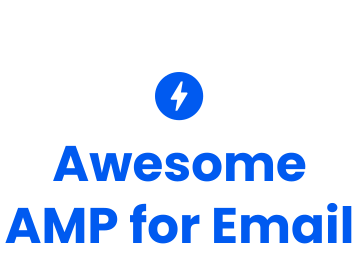

	

<b>Awesome resources and tools for AMP for Email ⚡💌</b>

	<a href="https://github.com/ampproject/amphtml">GitHub</a>&nbsp;&nbsp;&nbsp;
	<a href="https://amp.dev/about/email/">Documentation</a>&nbsp;&nbsp;&nbsp;
  <a href="https://github.com/ampproject/wg-amp4email/">Working group</a>&nbsp;&nbsp;&nbsp;
	<a href="https://docs.google.com/forms/d/e/1FAIpQLSd83J2IZA6cdR6jPwABGsJE8YL4pkypAbKMGgUZZriU7Qu6Tg/viewform?fbzx=4406980310789882877">Slack</a>&nbsp;&nbsp;&nbsp;

## Email Clients
* [Gmail](https://developers.google.com/gmail/ampemail/)
* [Mail.ru](https://postmaster.mail.ru/amp)
* [Outlook.com](https://docs.microsoft.com/en-us/outlook/amphtml/)
* [Verizon Media](https://blog.postmaster.verizonmedia.com/post/183699380323/amp-support-in-yahoo-mail)

## ESPs
* [Adobe Campaign Classic](https://www.adobe.com/marketing/campaign.html)
* [Amazon Pinpoint](https://aws.amazon.com/pinpoint/)
* [Amazon Simple Email Service (SES)](https://aws.amazon.com/ses/)
* [AWeber](https://www.aweber.com/)
* [Blueshift](https://blueshift.com/)
* [Braze](https://www.braze.com/)
* [Cheetah Digital](https://www.cheetahdigital.com/)
* [Clang](https://www.e-village.com/clang/)
* [Copernica](https://www.copernica.com/)
* [Customer.io](https://customer.io/)
* [dotdigital](https://dotdigital.com/)
* [Elastic Email](https://elasticemail.com/)
* [eSputnik](https://esputnik.com/)
* [ExpressPigeon](https://expresspigeon.com/amp-dynamic-email)
* [Iterable](https://iterable.com/)
* [Klaviyo](https://www.klaviyo.com/)
* [MagNews](https://www.magnews.com/)
* [Mailrelay](https://mailrelay.com/)
* [Mapp Cloud](https://mapp.com/)
* [Maileon](https://www.maileon.com)
* [Mailgun](https://www.mailgun.com/)
* [Mailkit](https://www.mailkit.com/)
* [MessageGears](https://messagegears.com/)
* [MindBox](https://mindbox.cloud/)
* [MoonMail](https://www.moonmail.io)
* [Pepipost](https://pepipost.com/)
* [SendPulse](https://sendpulse.com/)
* [SocketLabs](https://www.socketlabs.com/)
* [SparkPost](https://www.sparkpost.com/)
* [Tripolis](https://www.tripolis.com/)
* [Twilio SendGrid](https://www.twilio.com/sendgrid)

## Template Editors
* [stripo](https://stripo.email/amp-support/)

## Developer Tools
* [AMP boilerplate](https://amp.dev/boilerplate/)
* [AMP Playground](https://playground.amp.dev/?runtime=amp4email)
* [Mail.ru Playground](https://postmaster.mail.ru/amp/playground.html?lang=en#hello-world)

## Guides and Documentation
* https://amp.dev/documentation/guides-and-tutorials/start/create_email/?format=email
* https://blog.mailtrap.io/amp-email/
* https://www.sparkpost.com/docs/user-guide/amp-for-email/
* https://email.uplers.com/infographics/google-amp-for-email/

## Templates
* https://github.com/leemunroe/amp-email-templates

## Examples
* [Stripo Father's Day Newsletter](https://viewstripo.email/d5eb8daa-7a11-46be-8144-39665bca00161592565578462?type=amphtml)
* [SparkPost Scavenger Hunt](https://glitch.com/edit/#!/sparkpost-amp)

## Talks and Interviews
* https://www.youtube.com/watch?v=BFgC7WfbWjY&t=5s
* https://www.youtube.com/watch?v=hTd67bMGkNA
* https://www.zoho.com/blog/campaigns/amp-for-email.html

## Blog Posts
* https://medium.com/better-marketing/interactive-forms-add-a-special-power-up-to-your-email-marketing-45d165bb6615
